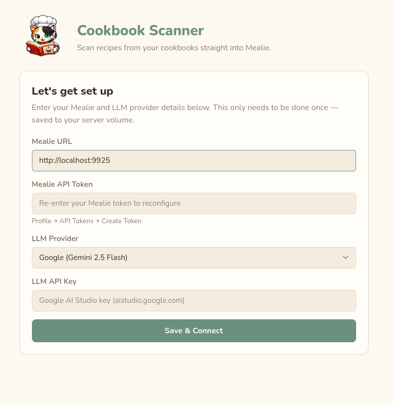

# mealie-cookbook-scanner

Scan a physical recipe page → OCR it → let an AI model structure it → import it straight into [Mealie](https://mealie.io).

Works entirely from the browser. No cloud sync, no account needed beyond your own Mealie instance and an LLM API key.



---

## What it does

1. **Scan** — upload or photograph a cookbook page. Rotate and crop, or use the column splitter for two-column layouts.
2. **OCR** — Tesseract extracts the text inside the container (no data leaves your machine for OCR).
3. **Structure** — your chosen AI model reads the raw text (or the image directly via vision) and returns structured JSON: title, ingredients, instructions, times, servings.
4. **Import** — one click sends everything to Mealie, including a hero image if you cropped one.

Multi-page recipes are supported: scan the second page and append it before sending to the AI.

---

## LLM providers

Choose either provider in the config screen:

| Provider | Model | Key source |
|---|---|---|
| **Anthropic** | Claude Haiku | [console.anthropic.com](https://console.anthropic.com) — billed per use |
| **Google** | Gemini 2.5 Flash | [aistudio.google.com](https://aistudio.google.com) — free tier available |

> **Gemini free tier:** create your API key at AI Studio from a project **without billing enabled**. If you use a billing-enabled Google Cloud project the free-tier quota is zero.

---

## Prerequisites

- Docker **or** Podman
- A running Mealie instance and an API token for it
- An API key for Anthropic or Google AI Studio

---

## Quick start

**Docker:**
```bash
docker run -d --name mealie-scanner \
  -p 8090:8090 \
  -v mealie-scanner-config:/app/config \
  --restart unless-stopped \
  ghcr.io/tysiana/mealie-cookbook-scanner:latest
```

**Podman:**
```bash
podman run -d --name mealie-scanner \
  --network=host \
  -v mealie-scanner-config:/app/config \
  --restart unless-stopped \
  ghcr.io/tysiana/mealie-cookbook-scanner:latest
```

> **Podman + host networking:** `--network=host` is required when Mealie also runs in a Podman container on the same machine — rootless Podman containers cannot reach each other's published ports via the LAN IP. With host networking, use `http://localhost:<mealie-port>` as the Mealie URL in the config screen. The scanner is still accessible from other machines at `http://<server-ip>:8090`.

Open **http://localhost:8090** and follow the one-time setup wizard.

---

## Configuration

On first launch the app asks for:

| Field | Description |
|---|---|
| Mealie URL | Your Mealie base URL, e.g. `http://192.168.1.10:9925` |
| Mealie token | Mealie → Profile → API Tokens → Create |
| LLM provider | Anthropic or Google |
| LLM API key | From console.anthropic.com or aistudio.google.com |

Credentials are stored in the named volume (`mealie-scanner-config`) and never leave the container. The UI never displays them again after saving.

---

## How it works

```
Browser → FastAPI (port 8090)
             ├─ /api/ocr               — Tesseract (runs inside container)
             ├─ /api/structure         — LLM text → JSON
             ├─ /api/structure-image   — LLM vision (image → JSON, skips OCR)
             └─ /api/import            — Mealie REST API
```

The prompt used for extraction lives in `app/prompts/recipe_extraction.md` — edit it to tune output without touching code.

---

## Project layout

```
app/
  config.py          load/save config JSON from mounted volume
  llm.py             LLMProvider ABC + get_provider() factory
  providers/
    anthropic.py     Anthropic Claude implementation
    gemini.py        Google Gemini implementation
  mealie.py          Mealie REST helpers
  ocr.py             Tesseract wrapper
  image_utils.py     image resize/reformat for vision + hero upload
  routes/
    config.py        GET+POST /api/config, GET /api/health, GET /api/models
    ocr.py           POST /api/ocr
    structure.py     POST /api/structure, /api/structure-image
    import_recipe.py POST /api/import
  prompts/
    recipe_extraction.md  extraction prompt (edit to tune output)
  static/
    index.html       single-page frontend (vanilla JS, no build step)
  imgs/
    mealiescancon.png  app logo
```

---

## Tuning extraction quality

Edit `app/prompts/recipe_extraction.md` and rebuild the image. The file is the complete prompt sent to the AI. Common tweaks:

- Add language-specific instructions for cookbooks not in English
- Tell the model to preserve section headers as `sectionTitle` fields
- Adjust how it handles missing prep/cook times

---

## License

MIT
